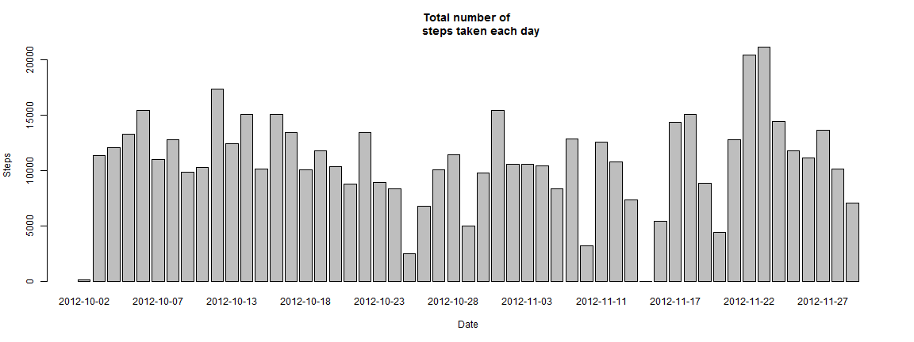
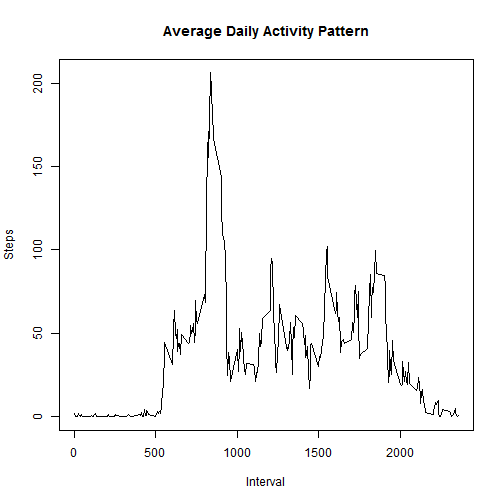

# Reproducible Research: 
#Peer Assessment 1    


## Loading and preprocessing the data
Set the working directory to to the direcory containing the activity data set.
Load the data

```r
activity <- read.csv("activity.csv")
```

## What is mean total number of steps taken per day?  
For this part of the assignment, you can ignore the missing values in the 
dataset.  
Remove all missing values from the data set.

```r
naOmitData <- na.omit(activity)
```

1. Make a histogram of the total number of steps taken each day

```r
totalSteps <- aggregate(steps ~ date, data = naOmitData, FUN = sum)
```


```r
barplot(totalSteps$steps, names.arg = totalSteps$date, main = "Total number of 
        steps taken each day",xlab = "Date", ylab = "Steps")
```

 

2. Calculate and report the **mean** and **median** total number of
   steps taken per day      

**Mean** total number of steps taken per day

```r
mean(totalSteps$steps)
```

```
## [1] 10766.19
```

**Median** total number of steps taken per day

```r
median(totalSteps$steps)
```

```
## [1] 10765
```
   

## What is the average daily activity pattern?   
1.Make a time series plot (i.e. type = "l") of the 5-minute interval (x-axis) 
and the average number of steps taken, averaged across all days (y-axis)  

```r
intervalSteps <- aggregate(steps ~ interval, data = naOmitData, FUN = mean)
plot(
        intervalSteps,
        type="l",
        main = "Average Daily Activity Pattern",
        ylab="Steps", 
        xlab="Interval"
        
)
```

 

2.Which 5-minute interval, on average across all the days in the dataset, 
contains the maximum number of steps?   


```r
intervalSteps[intervalSteps$steps== max(intervalSteps$steps),]
```

```
##     interval    steps
## 104      835 206.1698
```

## Imputing missing values
Note that there are a number of days/intervals where there are missing values 
(coded as NA). The presence of missing days may introduce bias into some 
calculations or summaries of the data.   

1. Calculate and report the total number of missing values in the dataset 
(i.e. the total number of rows with NAs)   

```r
sum(is.na(activity))
```

```
## [1] 2304
```

2. Devise a strategy for filling in all of the missing values in the dataset. 
The strategy does not need to be sophisticated. For example, you could use 
the mean/median for that day, or the mean for that 5-minute interval, etc.  

The variable **intervalsteps** contains the average daily pattern per interval and 
contains the interval values  which will be used to substiute the missing NA values.  
Using simple imputation substitute missing values into a new dataset.  

3. Create a new dataset that is equal to the original dataset but with 
the missing data filled in.   

```r
newactivity <-activity
for (i in 1:nrow(newactivity)){
        if (is.na(newactivity$steps[i])){
                newactivity$steps[i] <- intervalSteps[which(newactivity$interval[i] ==intervalSteps$interval),]$steps
        }
}
newactivity[!complete.cases(newactivity),]
```

```
## [1] steps    date     interval
## <0 rows> (or 0-length row.names)
```

4. Make a histogram of the total number of steps taken each day and 
Calculate and report the mean and median total number of steps taken per day.  

```r
newtotalSteps <- aggregate(steps ~ date, data = newactivity, FUN = sum)
```

```r
barplot(newtotalSteps$steps, names.arg = newtotalSteps$date, main = "Total number of 
        steps taken each day",xlab = "Date", ylab = "Steps")
```

 

**Mean** total number of steps taken per day

```r
mean(newtotalSteps$steps)
```

```
## [1] 10766.19
```

**Median** total number of steps taken per day

```r
median(newtotalSteps$steps)
```

```
## [1] 10766.19
```

Do these values differ from the estimates from the first part of the assignment?
What is the impact of imputing missing data on the estimates of the total daily 
number of steps?  
Yes the values differ.Althought the mean is identical to the previous incomplete
dataset the median has shifted to a greater value than the original cleaned set.  

**Mean** Calculate mean difference

```r
mean(newtotalSteps$steps) - mean(totalSteps$steps)
```

```
## [1] 0
```

**Median** Calculate median difference

```r
median(newtotalSteps$steps) - median(totalSteps$steps)
```

```
## [1] 1.188679
```

## Are there differences in activity patterns between weekdays and weekends?
Create a new factor variable in the dataset with two levels - "weekday" and "weekend" 
indicating whether a given date is a weekday or weekend day.

```r
newactivity<- within(newactivity, {
        weekendIndicator <-NA
        weekendIndicator[weekdays(as.Date(date)) =="Monday"    | weekdays(as.Date(date)) =="Tuesday"  |
                         weekdays(as.Date(date)) =="Wednesday" | weekdays(as.Date(date)) =="Thursday" |
                         weekdays(as.Date(date)) =="Friday" ]<- "weekday"
        weekendIndicator[weekdays(as.Date(date)) =="Saturday"    | weekdays(as.Date(date)) =="Sunday"]<- "weekend"
})
```

Make a panel plot containing a time series plot (i.e. type = "l") of the 5-minute interval (x-axis) and the average number of steps taken, averaged across all weekday days or weekend days (y-axis). See the README file in the GitHub repository to see an example of what this plot should look like using simulated data.

```r
weekIndicatorintervalSteps <- aggregate(newactivity$steps,list(Interval = 
        newactivity$interval,Indicator=newactivity$weekendIndicator), FUN = mean)
names(weekIndicatorintervalSteps)[3]<-"Steps"
library(lattice)
xyplot(weekIndicatorintervalSteps$Steps ~ weekIndicatorintervalSteps$Interval
       | weekIndicatorintervalSteps$Indicator, 
       layout = c(1, 2), type = "l", 
       xlab = "Interval", ylab = "Number of steps")
```

 

