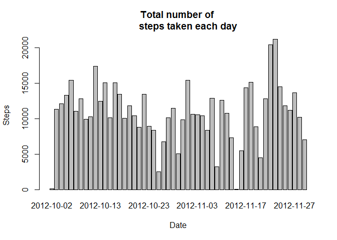
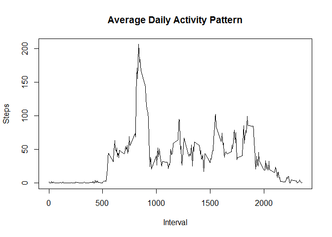
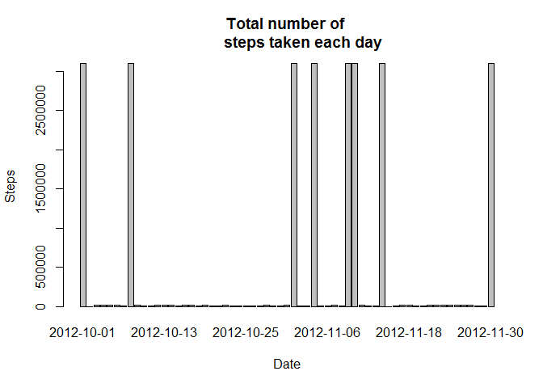

# Reproducible Research: Peer Assessment 1


## Loading and preprocessing the data


```r
activity <- read.csv("activity.csv")
```

## What is mean total number of steps taken per day?  
For this part of the assignment, you can ignore the missing values in the 
dataset.  

```r
naOmitData <- na.omit(activity)
```

1. Make a histogram of the total number of steps taken each day

```r
totalSteps <- aggregate(steps ~ date, data = naOmitData, FUN = sum)
barplot(totalSteps$steps, names.arg = totalSteps$date, main = "Total number of 
        steps taken each day",xlab = "Date", ylab = "Steps")
```

 

2. Calculate and report the **mean** and **median** total number of
   steps taken per day      

**Mean** total number of steps taken per day

```r
mean(totalSteps$steps)
```

```
## [1] 10766.19
```

**Median** total number of steps taken per day

```r
median(totalSteps$steps)
```

```
## [1] 10765
```
   

## What is the average daily activity pattern?   
1.Make a time series plot (i.e. type = "l") of the 5-minute interval (x-axis) 
and the average number of steps taken, averaged across all days (y-axis)  

```r
intervalSteps <- aggregate(steps ~ interval, data = naOmitData, FUN = mean)
plot(
        intervalSteps,
        type="l",
        main = "Average Daily Activity Pattern",
        ylab="Steps", 
        xlab="Interval"
        
)
```

 

2.Which 5-minute interval, on average across all the days in the dataset, 
contains the maximum number of steps?   


```r
intervalSteps[intervalSteps$steps== max(intervalSteps$steps),]
```

```
##     interval    steps
## 104      835 206.1698
```

## Imputing missing values
Note that there are a number of days/intervals where there are missing values 
(coded as NA). The presence of missing days may introduce bias into some 
calculations or summaries of the data.   

1. Calculate and report the total number of missing values in the dataset 
(i.e. the total number of rows with NAs)   

```r
sum(is.na(activity))
```

```
## [1] 2304
```

2. Devise a strategy for filling in all of the missing values in the dataset. 
The strategy does not need to be sophisticated. For example, you could use 
the mean/median for that day, or the mean for that 5-minute interval, etc.   
My strategy is to use the mean, calculated previously. **mean(totalSteps$steps)**   

3. Create a new dataset that is equal to the original dataset but with 
the missing data filled in.   

```r
removedNaActivity <-activity
removedNaActivity$steps[is.na(removedNaActivity$steps)] <- mean(totalSteps$steps)  
```

4. Make a histogram of the total number of steps taken each day and 
Calculate and report the mean and median total number of steps taken per day.  

```r
totalInculdeSteps <- aggregate(steps ~ date, data = removedNaActivity, FUN = sum)
barplot(totalInculdeSteps$steps, names.arg = totalInculdeSteps$date, main = "Total number of 
        steps taken each day",xlab = "Date", ylab = "Steps")
```

 

Do these values differ from the estimates from the first part of the assignment?   

What is the impact of imputing missing data on the estimates of the total daily 
number of steps?   


## Are there differences in activity patterns between weekdays and weekends?
